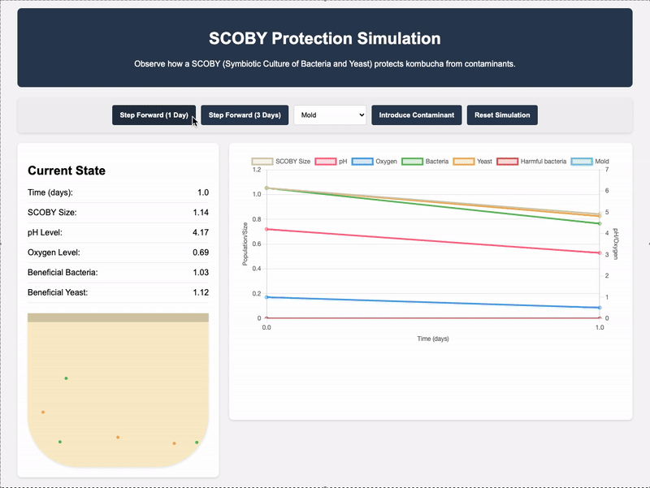

# SCOBY Kombucha Protection Simulation

This project provides an interactive simulation that demonstrates how a SCOBY (Symbiotic Culture of Bacteria and Yeast) protects kombucha during the fermentation process through various mechanisms.





## Overview

The simulation models:

- SCOBY's growth and development
- pH changes during fermentation
- Oxygen consumption
- Beneficial bacteria and yeast populations
- Interaction with contaminants (mold and harmful bacteria)

## Protective Mechanisms Demonstrated

1. **Physical Barrier**: The SCOBY forms a cellulose mat that physically blocks contaminants
2. **Acidic Environment**: Low pH inhibits harmful organisms
3. **Competitive Exclusion**: SCOBY organisms outcompete contaminants for resources
4. **Antimicrobial Compounds**: Produced during fermentation (modeled as part of the pH effect)
5. **Oxygen Consumption**: Creates anaerobic conditions unfavorable to certain contaminants

## Requirements

- Python (3 or higher)
- Flask
- NumPy
- Web browser with JavaScript enabled

## Installation

1. Clone the repository or download the source files
2. Install required packages:
   ```
   pip install flask numpy
   ```

## Running the Simulation

1. Start the Flask server:
   ```
   python app.py
   ```
   OR
   ```
   python3 app.py
   ```
2. Open a web browser and navigate to:
   ```
   http://127.0.0.1:5000
   ```

## Using the Simulation

The interface provides several interactive features:

- **Step Forward (1 Day)**: Advances the simulation by one day
- **Step Forward (3 Days)**: Advances the simulation by three days
- **Introduce Contaminant**: Add mold or harmful bacteria to the system
- **Reset Simulation**: Start over from initial conditions

The dashboard shows:
- Current state values (SCOBY size, pH, oxygen level, etc.)
- Visual representation of the kombucha jar with SCOBY and microorganisms
- Real-time charts tracking changes over time

## Implementation Details

### Mathematical Model

The simulation uses a set of simplified differential equations to model:

```
SCOBY growth:      dS/dt = r_s * S * (1 - S / K)
pH decrease:       dpH/dt = -k_pH * (S + B)
Oxygen decrease:   dO₂/dt = -k_O₂ * (S + B + Y)
Bacteria growth:   dB/dt = r_b * B * g_b(pH, O₂)
Yeast growth:      dY/dt = r_y * Y * g_y(pH, O₂)
Contaminant growth: dCᵢ/dt = rᵢ * Cᵢ * gᵢ(pH, O₂)
```

Where:
- g_b, g_y, and gᵢ are growth factors based on pH and oxygen preferences
- Contaminants are affected by the physical barrier mechanism, modeled as a probability function: P_block(S) = S / (S + S_half)

### Files

- `kombucha_simulation.py`: Core simulation model
- `app.py`: Flask server providing the API
- `templates/index.html`: Web interface with visualization

## Extending the Simulation

You can modify the simulation parameters in `kombucha_simulation.py` to explore different scenarios:

- Adjust growth rates of SCOBY, bacteria, yeast, or contaminants
- Change pH thresholds for different organisms
- Modify oxygen preferences
- Add new types of contaminants with different characteristics

## Educational Value

This simulation helps demonstrate:

- Microbial ecology and competition
- Fermentation processes
- Natural food preservation mechanisms
- Systems modeling in biology

## License

This project is provided for educational purposes. Feel free to modify and distribute while providing attribution to the original author: Adilbek Bazarkulov.
